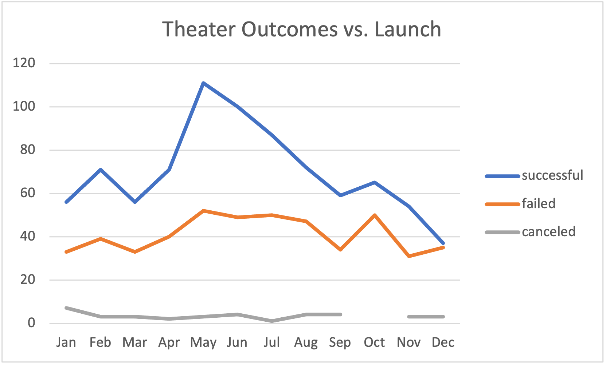
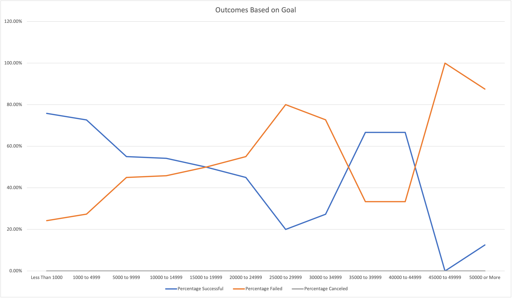

# Kickstarting with Excel

## Overview of Project
Data analysis was performed on the collected data to assist Louise in determining the factors that make a kickstarter campaign successful. 

### Purpose
Louise was interested in looking at what makes a kickstarter campaign successful as her play "Fever" had almost reached its goal in a short period of time. There are however plays which fail to reach their kickstarter goals and Louise is also interested in looking at that data to see what the contributing factors of successful kickstarters are. 

## Analysis and Challenges

### Analysis of Outcomes Based on Launch Date
Based on the analysis of outcomes based on launch date, it can be seen that a kickstart campaign for a "play" is more likely to be successful if created in May or June. See Figure 1. 
Additionally it can be identified that the worst time to start a kickstarter for a "play" would be in the winter months (Dec-Feb) as those months consistently have the lowest success rate. 

### Analysis of Outcomes Based on Goals
Based on the analysis of outcomes based on goals, it is shown that a lower kickstarter goal will yield a more successful kickstarter campaign. Success being defined as it reaching it desired monetary goal. There are also several points where a kickstarter is more likely to fail. These points are from $15,000 to $34,999 and from $44,999-$50,000+. 

### Challenges and Difficulties Encountered

A challenge for me would be using the =countifs formula. I struggled developing a formula that would work reliably and kept resulting with 0 in several cells. Eventually I was able to figure out what the issues was and resolved it (Ex: =COUNTIFS(KickStarter!$D:$D,"<1000",KickStarter!$F:$F,"failed",KickStarter!$R:$R,"plays"). Another difficulty that I had was selected data from nonadjacent rows in a table to use for a chart. I am unfamiliar with the key shortcuts on Mac but eventually figured that out. 

## Results

Based on the data analyzed from the "Theater Outcomes by Launch Date" it can be inferred that "theater" related kickstarter campaigns are more likely to succeed if they are launched in the middle of the calendar year (May and June). It can also be stated that the failure rate for a kickstarter campaign is not impacted by launch time as there is a similar rate of failure through the calendar year. 

Based on the data analyzed from the "Outcomes Based on Goals" sheet, it is shown that the lower the goal is for a kickstarter, the more likely it is to be successful. Additionally, there is a limit to how much money individuals are willing to donate to a kickstarter and that when a kickstarter requires more than $45,000 it's rate of success plummets to around 10% or less. 

Analysis was only performed on "plays" and doesn't necessarily paint a full picture on the success of kickstarter campaigns that fall under the "theatre" parent category. There might be other categories of kickstarter campaigns that perform better if they require a higher goal which could throw off success/failure rate of the different goal amounts.

Another table/graph that could be created would be the time between date created and the deadline (length of campaign) and the money raised during that time. It could paint a clearer picture on how quickly certain plays make money which could incline a playwright to make plays off a similar type so that they are complete. A second table/graph would be an inclusion of "backers" into the amount a table including pledged, goal, and the category of your choice. More backers would show that more people view that campaign favorably which a single backer donating $1,000 to achieve a campaign could fail if reintroduced at another time. 
